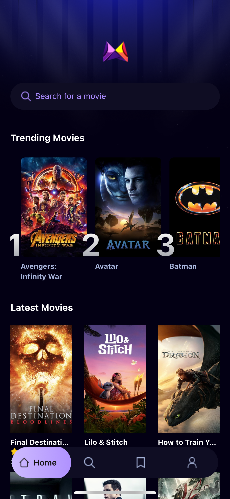
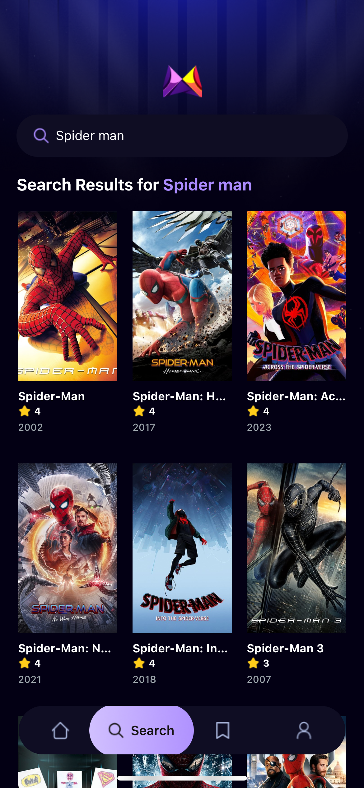

# 🎬 Movie Flix

**Movie Flix** is a clean, intuitive React Native app for browsing trending and top-rated movies using the [TMDB API](https://www.themoviedb.org/documentation/api). Built with **Expo**, the app features smooth navigation, dynamic search, and persistent search storage powered by **Appwrite** — all wrapped in a modern mobile UI that mirrors today’s top streaming apps.

---

## 📱 Preview

- 
- 
- 

---

## 🚀 Features

- 🔍 **Search and browse** trending or top-rated movies
- 📄 **View movie details** like synopsis, release date, and rating
- 💾 **Store search queries** in Appwrite for analytics and personalized content
- 📊 **Display trending searches** to reflect user interest dynamically
- ⚙️ **File-based routing** for organized navigation
- 🎨 **Clean, responsive UI** with modular React Native components

---

## 🛠 Tech Stack

- [React Native](https://reactnative.dev/)
- [Expo](https://expo.dev/)
- [TMDB API](https://www.themoviedb.org/)
- [React Navigation](https://reactnavigation.org/)
- [Appwrite](https://appwrite.io/) — backend-as-a-service for storing search queries

---

## ⚙️ Getting Started

1. **Clone the repository**

   ```bash
   git clone https://github.com/ortizrodrigo/movie_flix.git
   cd movie_flix
